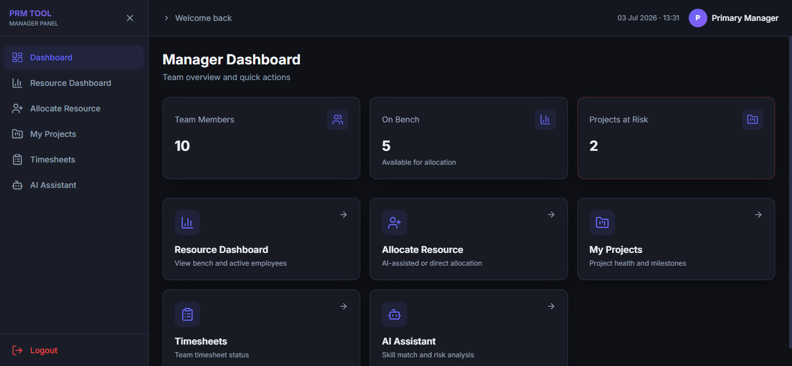
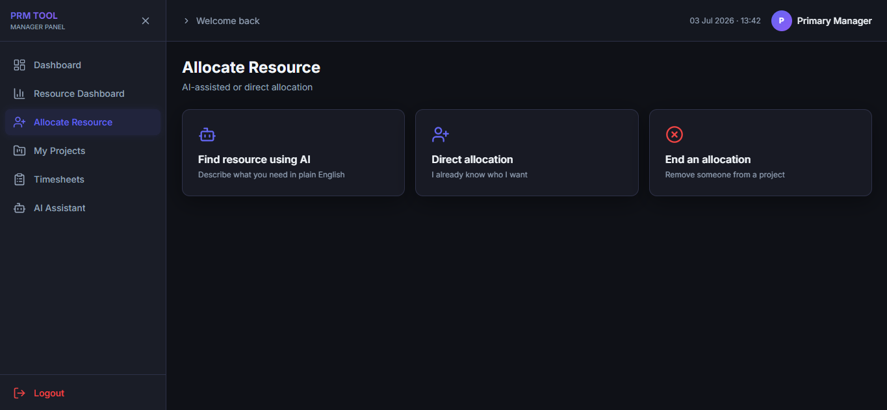
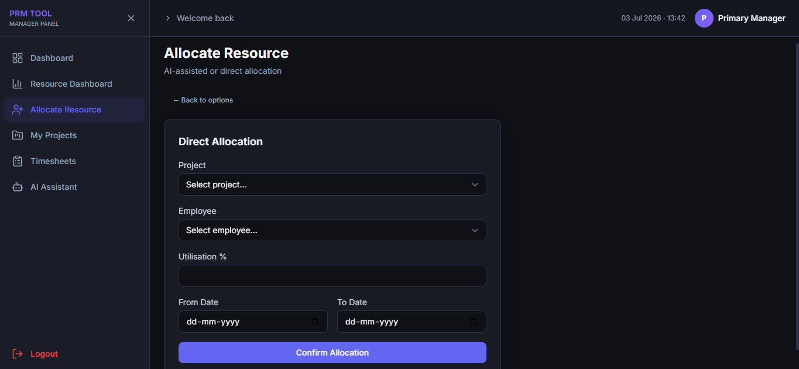
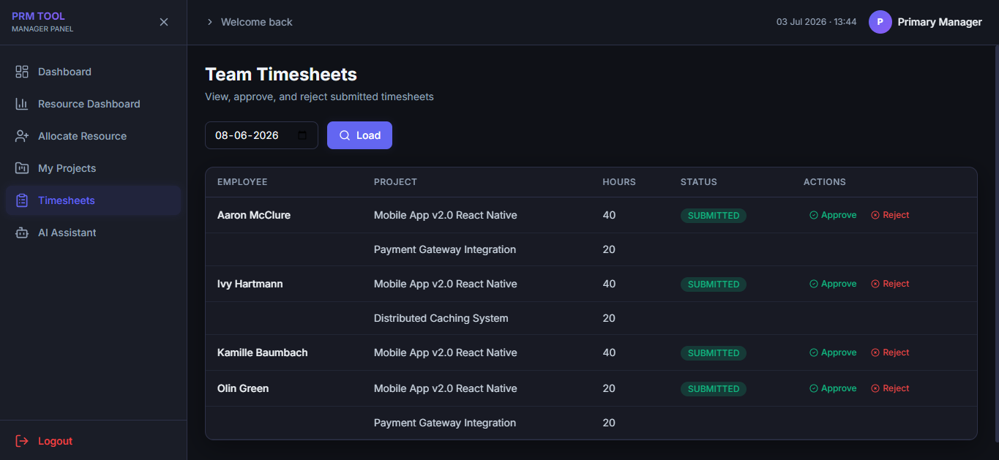
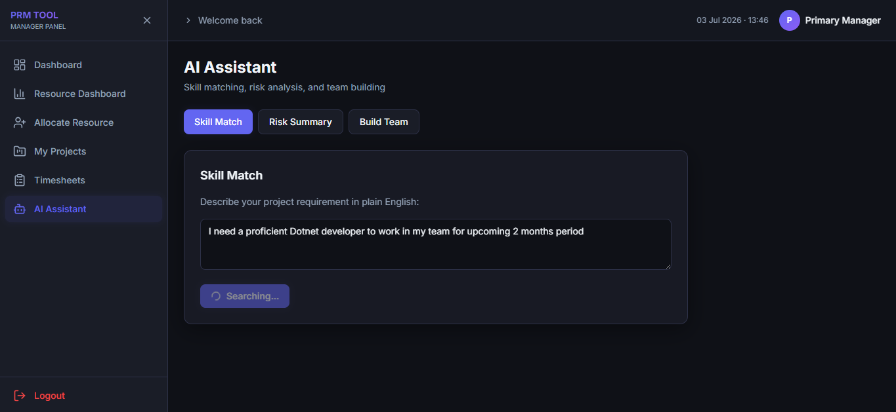
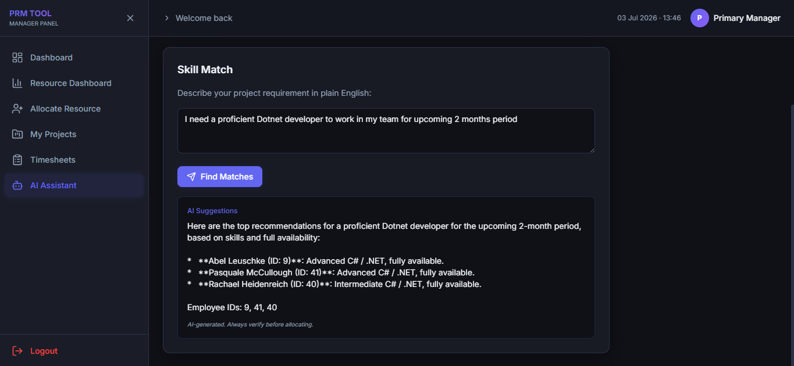
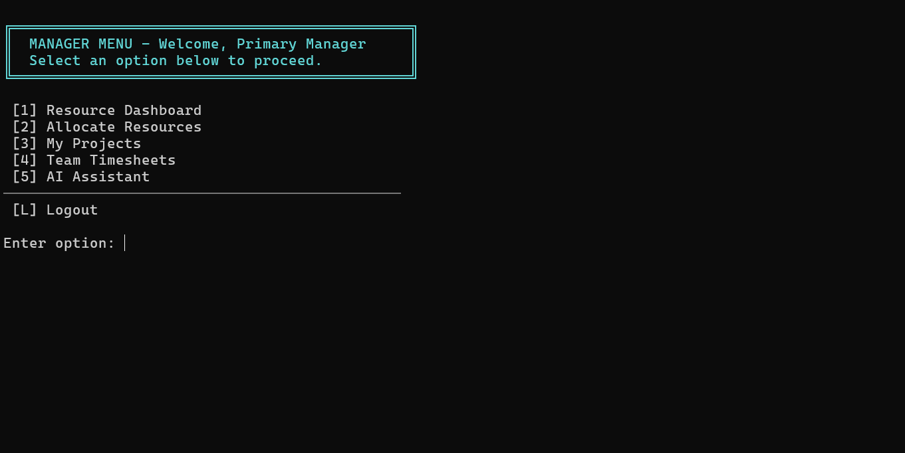

# Project Resource Manager (PRM)


> A comprehensive, modern client-server application for managing employees, projects, resource allocations, timesheets, and AI-powered skill matching in an IT services company.



---

## 📋 Overview & Features

Project Resource Manager (PRM) streamlines the management of IT service resources by providing tools to handle timesheets, resource allocation, and advanced AI skill matching.

### Core Capabilities
- **Employee & Project Management:** Full lifecycle management for users, roles, and project milestones.
  
  

- **Resource Allocation:** Ensure optimal utilization without exceeding 100% bandwidth.
  
  

- **Timesheet Tracking:** Secure, weekly timesheet submissions linked to active project allocations.
  
  

- **AI-Powered Skill Matching:** Integrates with LLMs (Google Gemini / Groq) for intelligent resource matching and risk analysis.
  
  
  

- **Automated Background Scheduling:** Hosted services compute resource utilization and project health flags automatically.

### Role-Based Access
- **Admin:** Complete system configuration, user/project management, and global resource allocation.
- **Manager:** Access to team dashboard, manage specific project allocations, and utilize AI matching.
- **Employee:** Submit weekly timesheets and view personal project allocations.

---

## 🏗 Architecture & Tech Stack

The solution follows a strict **Clean Architecture** (Onion/Hexagonal) design, splitting concerns across distinct layers to ensure maintainability and testability.

### Backend Server (`server/`)
- **Framework:** ASP.NET Core Web API (.NET 8 LTS)
- **Architecture:** Clean Architecture (`PRM.API`, `PRM.Application`, `PRM.Core`, `PRM.Infrastructure`)
- **Database ORM:** Entity Framework Core (EF Core) 8
- **Authentication:** JWT Bearer Tokens
- **Design Patterns:** Repository, Strategy (for LLM selection), Dependency Injection

### Web Frontend (`frontend/`)
- **Framework:** React + Vite
- **Styling:** Tailwind CSS
- **Features:** Modern, responsive UI with state-of-the-art aesthetics and micro-animations.

### Console Client (`client/`)
- **Framework:** .NET 8 Console Application
- **Purpose:** A lightweight, interactive CLI alternative for managing resources and interacting with the REST API.

---

## 📂 Repository Structure

```text
ProjectResourceManager/
├── server/                 # ASP.NET Core Web API Backend
│   └── src/
│       ├── PRM.API/        # Entry point, Controllers, Middleware
│       ├── PRM.Application/# Business Logic, DTOs, Validation
│       ├── PRM.Core/       # Domain Entities, Interfaces, Constants
│       └── PRM.Infrastructure/ # DB Context, Repositories, Background Jobs
├── client/                 # .NET 8 Interactive Console Application
│   └── src/                # CLI logic, API Clients, Screens
├── frontend/               # React + Vite Web Application
│   └── src/                # Components, Pages, API integration
├── docs/                   # Detailed Markdown Documentation
│   ├── database-schema.md  # DB Schema Definitions
│   ├── api-contracts.md    # API endpoints & DTOs
│   ├── ai-integration.md   # LLM Prompt Templates
│   └── ...                 
├── PROJECT_CONTEXT.md      # Core Context & Architectural Decisions
└── README.md               # This File
```

---

## 🛠 Prerequisites

Ensure you have the following installed before proceeding:
- [.NET 8 SDK](https://dotnet.microsoft.com/download/dotnet/8.0)
- [Node.js](https://nodejs.org/) (v18+ recommended)
- [Microsoft SQL Server](https://www.microsoft.com/en-us/sql-server/sql-server-downloads) (or LocalDB for development)

---

## 🚀 Getting Started (Local Development)

### Step 1: Database Setup
The backend uses EF Core Code-First migrations. The database will be created and seeded automatically when the API starts.
- Ensure your SQL Server instance is running.
- Update the `DefaultConnection` string in `server/src/PRM.API/appsettings.json` if your local SQL Server requires specific credentials or a different instance name.

### Step 2: Running the Backend API
Navigate to the API directory and run the project:
```bash
cd server/src/PRM.API
dotnet run
```
*The API will typically be hosted at `http://localhost:5000` or `https://localhost:5001`. Swagger UI is available at `/swagger` in the development environment.*

### Step 3: Running the Console Client (Optional CLI)
In a new terminal window, navigate to the console client directory:
```bash
cd client/src
dotnet run
```


### Step 4: Running the Web Frontend
In a new terminal window, install dependencies and start the Vite development server:
```bash
cd frontend
npm install
npm run dev
```
*The frontend will typically be hosted at `http://localhost:5173`. Open this URL in your browser.*

---

## ⚙️ Configuration (appsettings.json)

Key settings in `server/src/PRM.API/appsettings.json`:

- **ConnectionStrings:DefaultConnection**: Points to your SQL Server.
- **JwtSettings**: Configures the `Issuer`, `Audience`, and `SecretKey` for token generation.
- **LlmSettings**:
  - `Provider`: Choose between `"Gemini"` or `"Groq"`.
  - `ApiKey`: Your respective provider API key.

---

## 🔐 Default Credentials

Upon the first run, the database seeding script automatically creates a bootstrap administrator account:

- **Username:** `admin`
- **Password:** `Admin@1234`

> **Note:** The system enforces a mandatory password change upon the first successful login.

---

## 📚 Further Documentation

For deep dives into specific areas of the architecture and business rules, please refer to the detailed documentation located in the `docs/` folder:

- [System Architecture & Context](file:///c:/Users/jayesh.s.lodha/OneDrive%20-%20InTimeTec%20Visionsoft%20Pvt.%20Ltd.,/Documents/project-resource-manager/PROJECT_CONTEXT.md)
- [Database Schema](file:///c:/Users/jayesh.s.lodha/OneDrive%20-%20InTimeTec%20Visionsoft%20Pvt.%20Ltd.,/Documents/project-resource-manager/docs/database-schema.md)
- [API Contracts](file:///c:/Users/jayesh.s.lodha/OneDrive%20-%20InTimeTec%20Visionsoft%20Pvt.%20Ltd.,/Documents/project-resource-manager/docs/api-contracts.md)
- [Authentication Flow](file:///c:/Users/jayesh.s.lodha/OneDrive%20-%20InTimeTec%20Visionsoft%20Pvt.%20Ltd.,/Documents/project-resource-manager/docs/auth-flow.md)
- [AI Integration Details](file:///c:/Users/jayesh.s.lodha/OneDrive%20-%20InTimeTec%20Visionsoft%20Pvt.%20Ltd.,/Documents/project-resource-manager/docs/ai-integration.md)
- [Background Scheduler](file:///c:/Users/jayesh.s.lodha/OneDrive%20-%20InTimeTec%20Visionsoft%20Pvt.%20Ltd.,/Documents/project-resource-manager/docs/scheduler-design.md)
